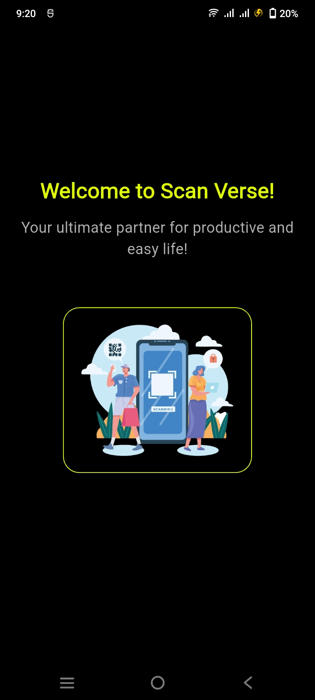
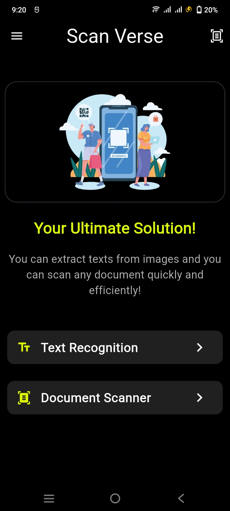
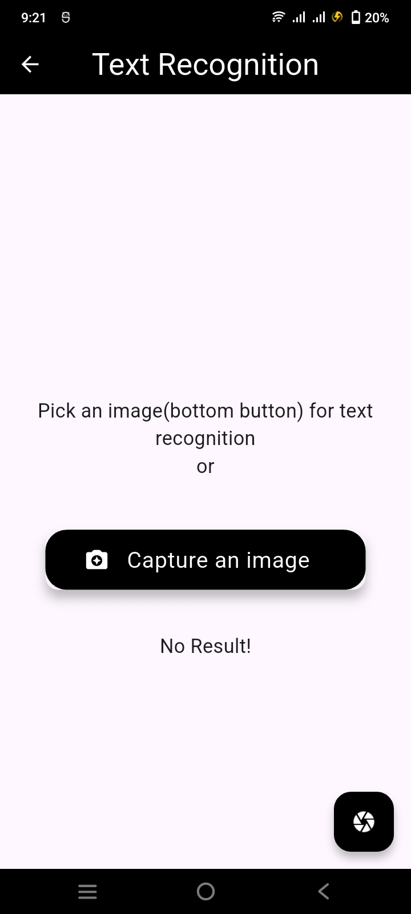
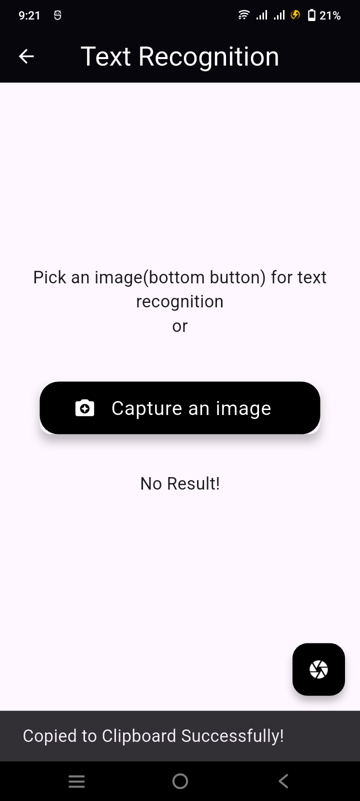
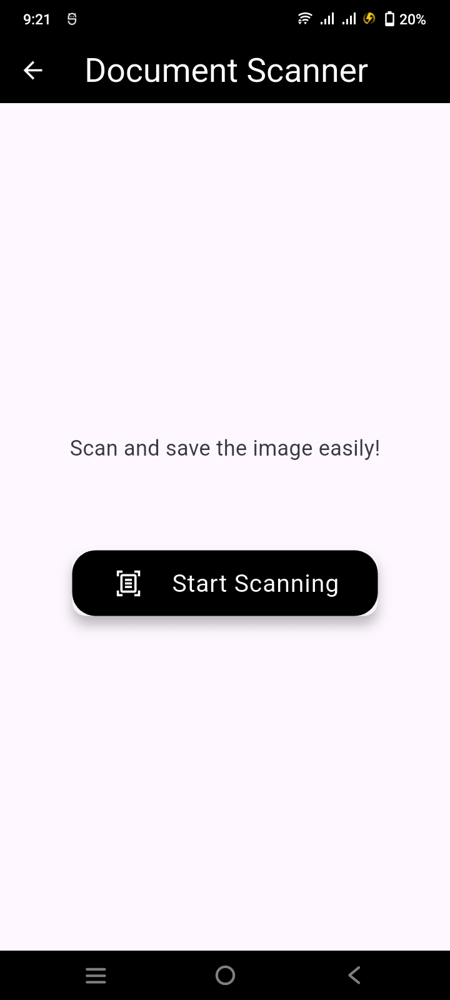
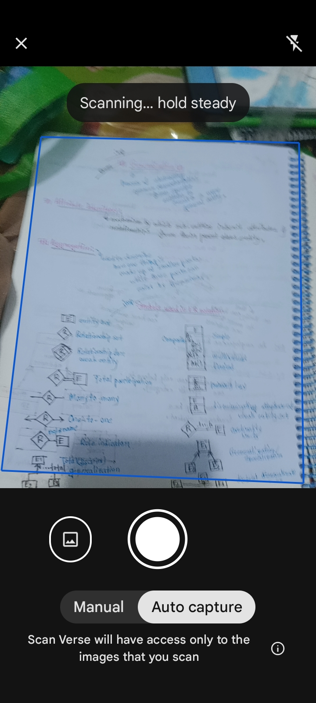
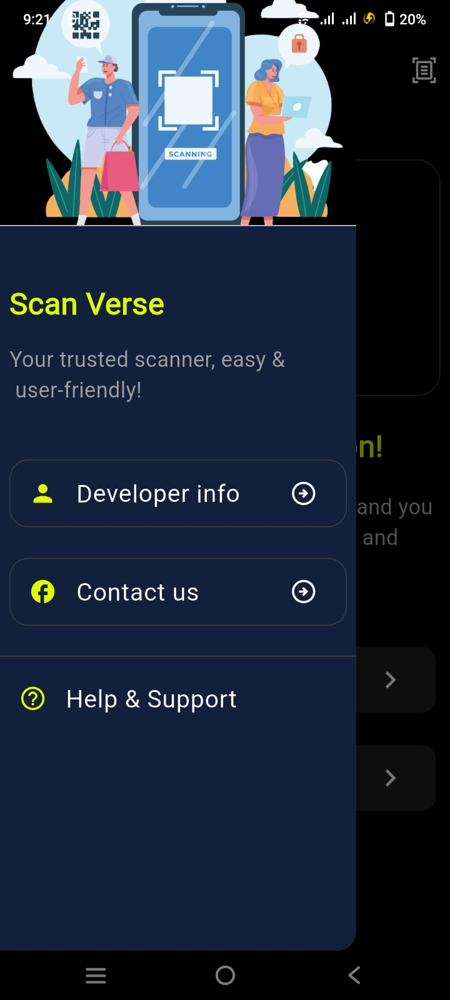
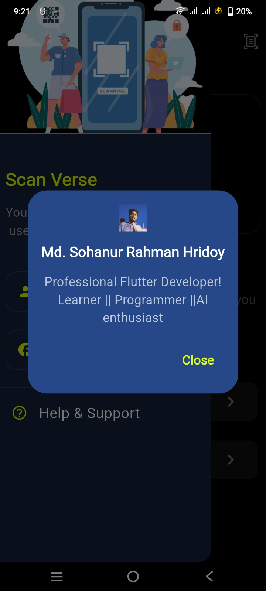

# Scan Verse - Text Recognition & Document Scanner App


## Overview
Scan Verse is a powerful Flutter-based mobile application designed to simplify document management and text recognition tasks. Leveraging Google ML Kit, the app allows users to scan documents, extract text, and save them efficiently. It's the perfect tool for students, professionals, and anyone looking to digitize and organize their documents seamlessly.

## Features
- **Text Recognition**: Extract text from images using Google ML Kit's advanced OCR capabilities.
- **Document Scanning**: Capture high-quality scans with auto-edge detection and perspective correction.
- **Export Options**: Save or share scanned documents as plain text or image files.
- **Offline Mode**: Perform OCR and manage documents without an internet connection.
- **Multi-Language Support**: Recognize text in various languages supported by Google ML Kit.

## Technologies Used
- **Framework**: Flutter
- **OCR Library**: Google ML Kit

## Installation
### Prerequisites
- Flutter SDK installed on your system.
- A device/emulator running Android 5.0 (Lollipop) or higher, or iOS 10.0 or later.

### Steps
1. Clone this repository:
   ```bash
   git clone https://github.com/SRHridoy/Scan_Verse.git
   ```
2. Navigate to the project directory:
   ```bash
   cd Scan_Verse
   ```
3. Install dependencies:
   ```bash
   flutter pub get
   ```
4. Run the app on your device or emulator:
   ```bash
   flutter run
   ```

## Usage
1. **Scan Document**: Use the camera to capture a document or import an image from the gallery.
2. **Extract Text**: Let the app process the image and extract the text using ML Kit.
3. **Edit or Save**: Edit the extracted text if needed, and save or share it as a text file.
4. **Organize**: View all your scanned documents in the history section.

## APK Download
To install the app without building it yourself, download the latest APK from the [Releases](https://github.com/SRHridoy/Scan_Verse/releases) section of this repository.
1. Visit the [Releases page](https://github.com/SRHridoy/Scan_Verse/releases).
2. Download the latest version of the APK.
3. Install it on your Android device.
4. [app-release.apk](build%2Fapp%2Foutputs%2Fflutter-apk%2Fapp-release.apk)

## Screenshots

<br>

<br>

<br>

<br>

<br>

<br>

<br>

<br>

<br>

## Roadmap
- Add support for handwriting recognition.
- Implement cloud storage integration (Google Drive, Dropbox, etc.).
- Enhance UI/UX with modern design patterns.
- Add support for batch processing of documents.

## Contributing
Contributions are welcome! Follow these steps:
1. Fork the repository.
2. Create a new branch (`feature-branch-name`).
3. Commit your changes.
4. Push to the branch and submit a pull request.

## Contact
For any questions or feedback, feel free to contact:
- **Name**: Md. Sohanur Rahman Hridoy
- **GitHub**: [SRHridoy](https://github.com/SRHridoy)
- **Email**: sohanurrahmanhridoy007@gmail.com

---
Thank you for using Scan Verse!
